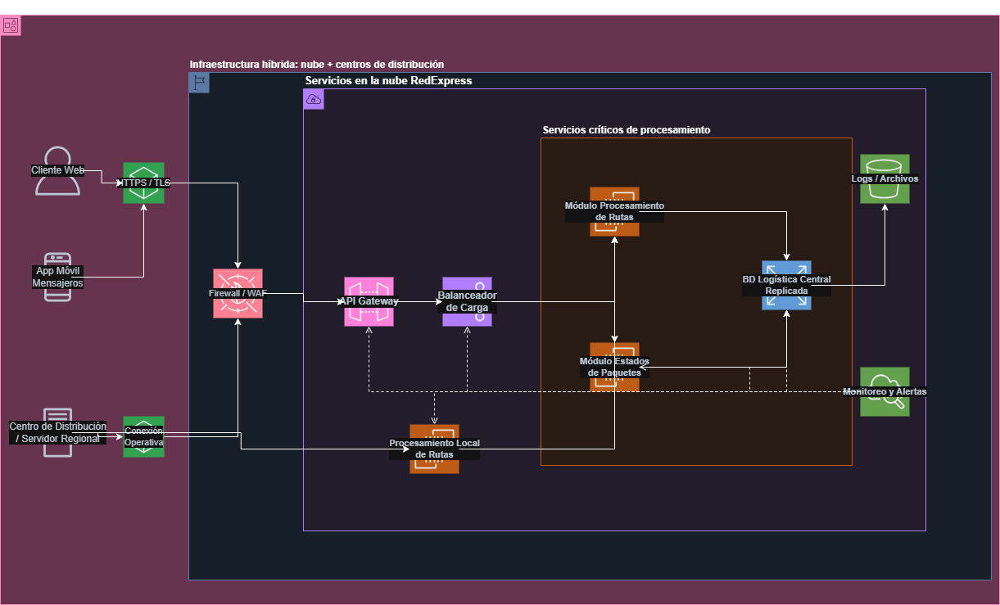

# Informe Técnico del Taller

## Nombre del Taller
**Taller 04 - Infraestructura y Topologías**

## Integrantes del equipo
- Valentina Lopez
- Mariana Valle
- Laura Rodriguez

## Descripción general del trabajo
En este taller se construyó el mapa de infraestructura del caso **RedExpress**, una plataforma de logística con una arquitectura híbrida compuesta por servicios en la nube, procesamiento regional, centros de distribución y dispositivos móviles usados por los mensajeros.

El propósito fue representar los componentes principales del sistema, entender cómo se relacionan entre sí e identificar riesgos técnicos como puntos únicos de falla, cuellos de botella y limitaciones de escalabilidad.

## Proceso de desarrollo
Para desarrollar el trabajo, primero se revisó el contexto del caso y los elementos que debían aparecer en el modelo. A partir de eso, se definieron como componentes principales el **API Gateway**, el **balanceador de carga**, los **módulos de rutas y estados de paquetes**, la **base de datos logística** y los **servicios de monitoreo y alertas**.

Después, se organizó el diagrama con una estructura híbrida para reflejar tanto los servicios en la nube como el procesamiento local o regional. Finalmente, se ajustaron nombres, relaciones y flujos para que el modelo fuera coherente con las necesidades del cliente y con el comportamiento esperado del sistema.

## Análisis del modelo propuesto
El modelo representa el flujo principal desde los usuarios de la plataforma web y la app móvil hacia los servicios internos del sistema. Las solicitudes ingresan por el API Gateway, pasan por el balanceador de carga y son dirigidas a los módulos de procesamiento de rutas y estados de paquetes, que a su vez se conectan con la base de datos logística.

Además, el diagrama incorpora monitoreo y alertas, junto con un componente regional asociado a centros de distribución, lo que permite reflejar la naturaleza híbrida de la infraestructura. Este modelo responde a las necesidades del cliente porque muestra los componentes críticos del sistema y permite visualizar de manera clara los posibles riesgos operativos.

### Supuestos tomados
- La arquitectura de RedExpress es híbrida.
- Los clientes acceden por web y app móvil.
- El API Gateway centraliza el acceso a los servicios.
- El balanceador distribuye las solicitudes entre módulos críticos.
- La base de datos requiere replicación para mejorar disponibilidad.
- El monitoreo debe cubrir los componentes más sensibles del sistema.

## Diagnóstico técnico

### Debilidades y cuellos de botella identificados
- Existe alta dependencia del **API Gateway** y del **balanceador de carga**, lo que puede convertirlos en puntos críticos de falla.
- El **módulo de procesamiento de rutas** puede saturarse en escenarios de alta demanda.
- El **módulo de estados de paquetes** puede presentar sobrecarga por actualizaciones constantes en tiempo real.
- La **base de datos logística** puede convertirse en un cuello de botella por la concentración de lecturas y escrituras.
- La sincronización entre nube y procesamiento regional puede generar **latencia**.
- La observabilidad puede ser insuficiente si no se cuenta con métricas, logs y alertas detalladas.

### Riesgos principales
| Riesgo | Impacto |
|--------|---------|
| Punto único de falla en entrada al sistema | Caída parcial o total del servicio |
| Saturación en módulos críticos | Lentitud en rutas y estados |
| Sobrecarga en base de datos | Bajo rendimiento general |
| Latencia entre regiones y nube | Retrasos en rastreo en tiempo real |
| Escalabilidad limitada | Problemas en temporadas pico |

## Oportunidades de mejora
- Aumentar la redundancia en componentes críticos.
- Implementar escalado horizontal en servicios principales.
- Fortalecer la base de datos con replicación o distribución por zonas.
- Mejorar la sincronización entre nube y centros regionales.
- Incorporar caché para reducir carga sobre la base de datos.
- Reforzar monitoreo con métricas, logs y alertas proactivas.

## Diagrama final entregado

## Tabla de componentes

| Componente | Función |
|------------|---------|
| API Gateway | Recibir y enrutar solicitudes |
| Balanceador de carga | Distribuir tráfico entre servicios |
| Módulo de rutas | Gestionar cálculo y procesamiento de rutas |
| Módulo de estados | Actualizar y consultar estados de paquetes |
| BD logística | Almacenar información principal del sistema |
| Monitoreo y alertas | Supervisar comportamiento y fallas |
| Centro regional | Soportar operación local y procesamiento híbrido |

## Conclusiones
El modelo propuesto permite representar de forma clara la infraestructura de RedExpress y entender cómo interactúan sus componentes principales. Además, facilita la identificación de riesgos relacionados con disponibilidad, rendimiento, latencia y escalabilidad.

El análisis muestra que los mayores retos del sistema están en la dependencia de componentes centrales, la carga sobre los servicios críticos y la necesidad de fortalecer la observabilidad. Por ello, el diagrama no solo describe la infraestructura actual, sino que también sirve como base para proponer mejoras.
